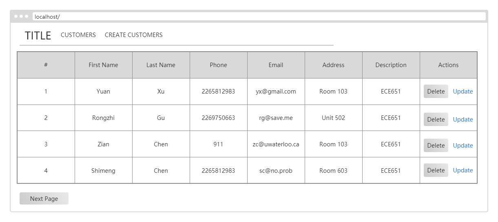

# Documentation of Customer Profile
- [Introduction](#intro)
- [Requirement](#req)
- [API](#api)
- [UI Design](#ui)


## <a name="intro">Introduction</a>
This is the documentation of customer profile branch. This branch
implements the addition, deletion and modification of the customer
profile. Please refer to this as a guideline. 

## <a name="req">Requirement</a>
### Functional Requirement
- User shall be able to create a new customer profile including first name,
last name, phone number, password, e-mail, address and description
- User shall be able to log into their account using phone number and password
- User shall be able to logout

### Non-functional Requirement
- App shall be able to auto login if user is willing to
- Only admin can edit(delete or modify) the customer profiles
- Admin shall be able to login/logout

## <a name="intro">API</a>
### /api/customers/

#### Request Method
GET

#### Function
List all the customers in the database

#### Parameter
None

#### Response Example
```
{
    'data': {
                '0':{
                        'pk': 1,
                        'first_name': "shimeng",
                        'last_name': "chen",
                        'email': "844650898@qq.com",
                        'phone': "123456789",
                        'address': "white house",
                        'description': "waterloo",
                },
                '1':{
                        'pk': 2,
                        'first_name': "shimeng",
                        'last_name': "chen",
                        'email': "shimengchern@gmail.com",
                        'phone': "2265812983",
                        'address': "20 west",
                        'description': "dt",
                },

                ......
            },
}
```

#### Possible Error State
None


#### Request Method
POST

#### Function
Create a new customer

#### Parameter

| Attribute | Type     | Required | Description|
| ---       |  ------  |--------- |----------- |
| first_name|  string  | yes      |First name of the user|
| last_name |  string  | yes      |Last name of the user|
| email |  string  | yes      |Email address of the user|
| phone |  string  | yes      |Phone number of the user|
| address |  string  | no      |Address of the user|
| description |  string  | no      |Additional description of the user, might be used for search|


#### Response Example
None

#### Possible Error State
- 400 BAD REQUEST

---

### /api/customers/&lt;pk&gt;
#### Request Method
GET

#### Function
Retrieve a customer by id/pk.

#### Parameter

| Attribute | Type     | Required | Description|
| ---       |  ------  |--------- |----------- |
| pk|  integer/string	  | yes      |Id or primary key of the user data|


#### Response Example
```
{
    'pk': 4,
    "first_name": "Rongzhi",
    "last_name": "Gu",
    "email": "rongzhi.gu@uwaterloo.ca",
    "phone": "2269750663",
    "address": "268 Lester St",
    "description": "(■)__(■) Soooooo Violentttttt (■)__(■)"
}
```
#### Possible Error State
- 404 NOT FOUND

#### Request Method
PUT

#### Function
Update a customer by id/pk.

#### Parameter
| Attribute | Type     | Required | Description|
| ---       |  ------  |--------- |----------- |
| pk|  integer/string	  | yes      |Id or primary key of the user data|
| first_name|  string  | yes      |First name of the user|
| last_name |  string  | yes      |Last name of the user|
| email |  string  | yes      |Email address of the user|
| phone |  string  | yes      |Phone number of the user|
| address |  string  | no      |Address of the user|
| description |  string  | no      |Additional description of the user, might be used for search|


#### Response Example
```
{
    'pk': 4,
    "first_name": "Rongzhi",
    "last_name": "Gu",
    "email": "rongzhi.gu@uwaterloo.ca",
    "phone": "2269750663",
    "address": "268 Lester St",
    "description": "Too young too simple"
}
```

#### Possible Error State
- 404 NOT FOUND
- 400 BAD REQUEST

#### Request Method
DELETE

#### Function
Delete a customer by id/pk.

#### Parameter

| Attribute | Type     | Required | Description|
| ---       |  ------  |--------- |----------- |
| pk|  integer/string	  | yes      |Id or primary key of the user data|


#### Response Example
- 204 NO CONTENT

#### Possible Error State
- 404 NOT FOUND

## <a name="ui">UI Design</a>
### Default


### Create Customer

